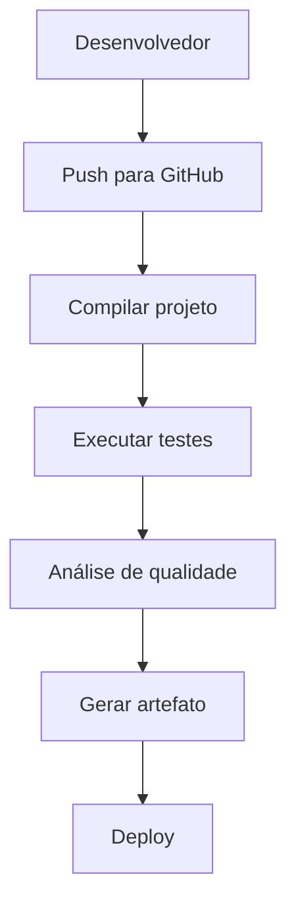
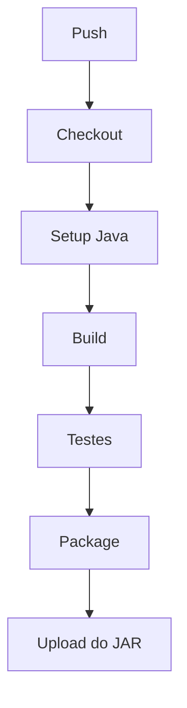

# Como construir uma pipeline no github

Construir uma pipeline no **GitHub** normalmente significa criar um fluxo de **Integração Contínua (CI)** e/ou **Entrega Contínua (CD)** usando o **GitHub Actions**. A pipeline automatiza tarefas como compilação, testes, análise de código e implantação sempre que ocorre um evento, como um *push* ou um *pull request*.

A seguir está um passo a passo detalhado.

---

# Passo 1 – Entender o que é uma pipeline

Uma pipeline é uma sequência automatizada de etapas executadas em determinada ordem.

Exemplo:



Cada etapa só é executada se a anterior for concluída com sucesso (quando configurado dessa forma).

---

# Passo 2 – Criar um repositório

Crie um repositório no GitHub.

Exemplo:

```
meu-projeto
```

Estrutura:

```
meu-projeto/
│
├── src/
├── tests/
├── README.md
└── .github/
```

O GitHub procura os arquivos de workflow dentro da pasta:

```
.github/workflows/
```

---

# Passo 3 – Criar a pasta de workflows

Dentro do projeto, crie:

```
.github/
    workflows/
```

Dentro dela crie um arquivo YAML.

Exemplo:

```
ci.yml
```

Estrutura:

```
.github/
    workflows/
        ci.yml
```

---

# Passo 4 – Nomear a pipeline

No início do arquivo:

```yaml
name: Pipeline CI
```

Este será o nome mostrado na aba **Actions** do GitHub.

--- 

# Passo 4 – Definir quando a pipeline será executada

Toda pipeline começa informando os eventos (*triggers*), ou seja, quais ações disparam sua execução.

Exemplo:

```yaml
on:
  push:
    branches:
      - main

  pull_request:
    branches:
      - main

  schedule:
    - cron: '0 10 * * *'
```

Neste exemplo, a pipeline será executada:

* Quando houver um **push** para a branch `main`;
* Quando um **Pull Request** for criado ou atualizado na branch `main`;
* Todos os dias às **02:00 UTC** por meio do gatilho `schedule`.

> **Importante:** O `schedule` utiliza o formato **cron** e considera sempre o fuso horário **UTC**.

### Descrição

* **push** → executa a pipeline quando alguém envia código para uma branch especificada.
* **pull_request** → executa a pipeline quando um Pull Request é criado, atualizado ou sincronizado.
* **schedule** → executa a pipeline automaticamente em dias e horários definidos por uma expressão cron.
* **branches** → define quais branches disparam a pipeline para os eventos `push` e `pull_request`.
* **cron** → expressão que define a frequência de execução da pipeline.

### Exemplos de expressões cron

| Expressão      | Descrição                            |
| -------------- | ------------------------------------ |
| `0 2 * * *`    | Todos os dias às 02:00 UTC           |
| `0 0 * * 1`    | Toda segunda-feira à meia-noite UTC  |
| `*/30 * * * *` | A cada 30 minutos                    |
| `0 */6 * * *`  | A cada 6 horas                       |
| `0 12 1 * *`   | Todo dia 1º de cada mês às 12:00 UTC |

Dessa forma, além de executar a pipeline em resposta a eventos do repositório, é possível agendar execuções periódicas, o que é útil para tarefas como testes noturnos, verificações de segurança, geração de relatórios ou manutenção automatizada.

---

# Passo 6 – Criar um Job

Uma pipeline possui um ou mais **Jobs**.

Exemplo:

```yaml
jobs:
  build:
```

Um Job representa um conjunto de etapas executadas na mesma máquina virtual.

Você pode ter:

* Build
* Test
* Deploy
* Security Scan

Cada um pode ser um Job diferente.

---

# Passo 7 – Escolher o sistema operacional

Dentro do Job:

```yaml
runs-on: ubuntu-latest
```

Outras opções:

```
ubuntu-latest

windows-latest

macos-latest
```

O GitHub cria automaticamente uma máquina virtual com o sistema operacional escolhido.

---

# Passo 8 – Adicionar os Steps

Cada Job possui vários Steps.

Exemplo:

```yaml
steps:
```

Um Step pode:

* baixar código;
* instalar dependências;
* executar testes;
* publicar arquivos.

---

# Passo 9 – Baixar o código

Primeiro Step:

```yaml
- name: Checkout
  uses: actions/checkout@v4
```

Descrição:

Esse Step faz o download do código do repositório para a máquina da pipeline.

Sem ele, não existe código para compilar.

---

# Passo 10 – Instalar a linguagem

Exemplo para Java:

```yaml
- name: Setup Java
  uses: actions/setup-java@v4
  with:
    distribution: temurin
    java-version: 21
```

Descrição:

Instala o Java 21 para ser usado na pipeline.

Para Node.js seria:

```yaml
uses: actions/setup-node
```

Para Python:

```yaml
uses: actions/setup-python
```

Cada linguagem possui sua própria Action oficial.

---

# Passo 11 – Instalar dependências

Exemplo Maven:

```yaml
- name: Install Dependencies
  run: mvn install
```

Descrição:

Baixa todas as bibliotecas do projeto.

Sem isso o projeto geralmente não compila.

---

# Passo 12 – Compilar

Exemplo:

```yaml
- name: Build
  run: mvn clean compile
```

Descrição:

Transforma o código-fonte em arquivos compilados.

---

# Passo 13 – Executar testes

Exemplo:

```yaml
- name: Test
  run: mvn test
```

Descrição:

Executa todos os testes automatizados.

Se algum teste falhar:

```
Pipeline FAILED
```

A pipeline é interrompida (salvo configurações diferentes).

---

# Passo 14 – Gerar artefatos

Exemplo:

```yaml
- name: Package
  run: mvn package
```

Resultado:

```
target/
    meu-projeto.jar
```

Esse arquivo pode ser implantado em outro ambiente.

---

# Passo 15 – Publicar artefato

Exemplo:

```yaml
- name: Upload Artifact
  uses: actions/upload-artifact@v4
  with:
    name: aplicativo
    path: target/*.jar
```

Descrição:

Armazena o arquivo gerado para download posterior pela interface do GitHub.

---

# Passo 16 – Fazer Deploy

Exemplo:

```yaml
- name: Deploy
  run: ./deploy.sh
```

Ou:

```
Deploy para Azure

Deploy para AWS

Deploy para Kubernetes

Deploy para Docker

Deploy para servidor Linux
```

O deploy normalmente utiliza credenciais armazenadas como **Secrets** do repositório.

---

# Passo 17 – Pipeline completa

Exemplo de uma pipeline simples para um projeto Java com Maven:

```yaml
name: CI Pipeline

on:
  push:
    branches:
      - main

  pull_request:
    branches:
      - main

jobs:
  build:

    runs-on: ubuntu-latest

    steps:

      - name: Checkout
        uses: actions/checkout@v4

      - name: Setup Java
        uses: actions/setup-java@v4
        with:
          distribution: temurin
          java-version: 21

      - name: Build
        run: mvn clean compile

      - name: Test
        run: mvn test

      - name: Package
        run: mvn package

      - name: Upload Artifact
        uses: actions/upload-artifact@v4
        with:
          name: app
          path: target/*.jar
```

Fluxo:



[Veja outros modelos na pasta projetos](./projetos/)

---

# Passo 18 – Acompanhar a execução

Após enviar o arquivo `ci.yml` para o repositório:

1. Faça um `git add`, `git commit` e `git push`.
2. No GitHub, abra a aba **Actions**.
3. Selecione o workflow **Pipeline CI**.
4. Acompanhe cada etapa em tempo real, visualizando logs, duração e possíveis erros.

---

## Conceitos importantes

| Conceito         | Descrição                                                                                     |
| ---------------- | --------------------------------------------------------------------------------------------- |
| **Workflow**     | Arquivo YAML que define toda a automação.                                                     |
| **Event (`on`)** | Evento que dispara a execução da pipeline, como `push` ou `pull_request`.                     |
| **Job**          | Conjunto de etapas executadas em um mesmo ambiente de execução.                               |
| **Step**         | Ação individual dentro de um Job, como instalar dependências ou executar testes.              |
| **Action**       | Componente reutilizável que executa uma tarefa específica (por exemplo, `actions/checkout`).  |
| **Runner**       | Máquina virtual ou servidor que executa a pipeline (`ubuntu-latest`, `windows-latest`, etc.). |
| **Artifact**     | Arquivo gerado pela pipeline e armazenado para download ou uso em etapas posteriores.         |
| **Secrets**      | Variáveis protegidas usadas para armazenar credenciais e tokens com segurança.                |

Esse fluxo é a base para pipelines de CI/CD no GitHub Actions e pode ser expandido para incluir verificações de segurança, análise de qualidade de código, execução em múltiplos ambientes e implantações automatizadas.

