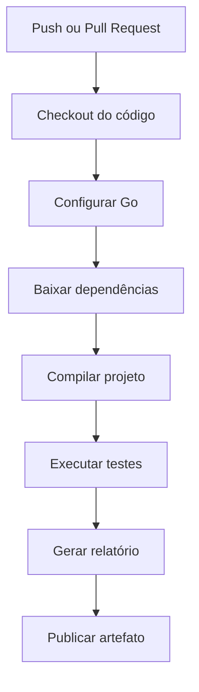

# Projeto: Pipeline de CI com GitHub Actions em Go

Este projeto demonstra como criar uma **pipeline de Integração Contínua (CI)** utilizando **GitHub Actions** para um projeto desenvolvido em **Go (Golang)**. A pipeline executará automaticamente as principais etapas de validação do projeto:

* Fazer o checkout do código;
* Configurar o ambiente Go;
* Baixar as dependências;
* Compilar a aplicação;
* Executar os testes automatizados;
* Gerar um relatório simples;
* Publicar o relatório como artefato.

---

# Objetivo do projeto

O projeto implementa uma pequena calculadora com operações matemáticas básicas. Sempre que houver um **push** ou **Pull Request** para a branch `main`, o GitHub Actions executará a pipeline para validar o código.

---

# Estrutura do projeto

```text
go-ci-pipeline/
│
├── calculator/
│   └── calculator.go
│
├── tests/
│   └── calculator_test.go
│
├── reports/
│
├── go.mod
├── report.go
├── README.md
│
└── .github/
    └── workflows/
        └── ci.yml
```

---

# Descrição da estrutura

| Pasta/Arquivo              | Descrição                                                |
| -------------------------- | -------------------------------------------------------- |
| `calculator/`              | Contém o código-fonte da aplicação.                      |
| `tests/`                   | Contém os testes automatizados.                          |
| `reports/`                 | Diretório onde será gerado o relatório da pipeline.      |
| `go.mod`                   | Arquivo de configuração do módulo Go.                    |
| `report.go`                | Programa responsável por gerar um relatório da execução. |
| `.github/workflows/ci.yml` | Workflow do GitHub Actions.                              |

---

# Inicializando o projeto

Antes de criar os arquivos, inicialize o módulo Go:

```bash
go mod init github.com/seu-usuario/go-ci-pipeline
```

Isso criará o arquivo:

```text
go.mod
```

---

# Código da aplicação

Arquivo:

```text
calculator/calculator.go
```

```go
package calculator

import "errors"

func Soma(a, b int) int {
	return a + b
}

func Subtracao(a, b int) int {
	return a - b
}

func Multiplicacao(a, b int) int {
	return a * b
}

func Divisao(a, b int) (int, error) {

	if b == 0 {
		return 0, errors.New("divisão por zero")
	}

	return a / b, nil
}
```

---

# Testes automatizados

Arquivo:

```text
tests/calculator_test.go
```

```go
package tests

import (
	"testing"

	"github.com/seu-usuario/go-ci-pipeline/calculator"
)

func TestSoma(t *testing.T) {

	if calculator.Soma(10, 5) != 15 {
		t.Error("Erro na soma")
	}
}

func TestSubtracao(t *testing.T) {

	if calculator.Subtracao(10, 5) != 5 {
		t.Error("Erro na subtração")
	}
}

func TestMultiplicacao(t *testing.T) {

	if calculator.Multiplicacao(10, 5) != 50 {
		t.Error("Erro na multiplicação")
	}
}

func TestDivisao(t *testing.T) {

	resultado, _ := calculator.Divisao(10, 2)

	if resultado != 5 {
		t.Error("Erro na divisão")
	}
}

func TestDivisaoPorZero(t *testing.T) {

	_, err := calculator.Divisao(10, 0)

	if err == nil {
		t.Error("Era esperado erro de divisão por zero")
	}
}
```

---

# Programa para geração do relatório

Arquivo:

```text
report.go
```

```go
package main

import (
	"fmt"
	"os"
	"time"
)

func main() {

	os.MkdirAll("reports", os.ModePerm)

	file, err := os.Create("reports/report.txt")

	if err != nil {
		panic(err)
	}

	defer file.Close()

	fmt.Fprintln(file, "RELATÓRIO DA PIPELINE")
	fmt.Fprintln(file, "=====================")
	fmt.Fprintf(file, "Data: %s\n", time.Now().Format(time.RFC3339))
	fmt.Fprintln(file, "Status: Testes executados com sucesso.")

	fmt.Println("Relatório gerado.")
}
```

---

# Arquivo go.mod

```go
module github.com/seu-usuario/go-ci-pipeline

go 1.22
```

---

# Pipeline do GitHub Actions

Arquivo:

```text
.github/workflows/ci.yml
```

```yaml
name: Go CI Pipeline

on:
  push:
    branches:
      - main

  pull_request:
    branches:
      - main

jobs:

  build:

    runs-on: ubuntu-latest

    steps:

      - name: Checkout do código
        uses: actions/checkout@v4

      - name: Configurar Go
        uses: actions/setup-go@v5
        with:
          go-version: '1.22'

      - name: Baixar dependências
        run: |
          go mod tidy

      - name: Compilar projeto
        run: |
          go build ./...

      - name: Executar testes
        run: |
          go test ./... -v

      - name: Gerar relatório
        run: |
          go run report.go

      - name: Publicar relatório
        uses: actions/upload-artifact@v4
        with:
          name: relatorio-go
          path: reports/
```

---

# Fluxo da pipeline



---

# Descrição das etapas da pipeline

| Etapa                   | Descrição                                                                                                       |
| ----------------------- | --------------------------------------------------------------------------------------------------------------- |
| **Checkout do código**  | Faz o download do código do repositório para o runner do GitHub Actions.                                        |
| **Configurar Go**       | Instala a versão do Go especificada no workflow (`1.22`).                                                       |
| **Baixar dependências** | Executa `go mod tidy` para resolver e baixar dependências do projeto.                                           |
| **Compilar projeto**    | Executa `go build ./...` para verificar se todo o código compila corretamente.                                  |
| **Executar testes**     | Executa todos os testes automatizados utilizando `go test ./... -v`.                                            |
| **Gerar relatório**     | Executa o programa `report.go`, que cria um arquivo de relatório em `reports/report.txt`.                       |
| **Publicar artefato**   | Publica o diretório `reports/` como artefato da execução, permitindo seu download na aba **Actions** do GitHub. |

---

# Resultado esperado

Após realizar um `git push` para a branch `main`, o GitHub Actions executará automaticamente a pipeline:

1. Provisiona um ambiente Ubuntu.
2. Instala o Go 1.22.
3. Resolve as dependências do módulo.
4. Compila toda a aplicação.
5. Executa os testes automatizados.
6. Gera um relatório de execução.
7. Publica o relatório como artefato.

Esse exemplo segue as convenções da linguagem Go, utilizando módulos (`go.mod`), organização por pacotes e ferramentas nativas (`go build` e `go test`). Ele pode ser expandido facilmente para incluir análise estática (`go vet`), linting (com `golangci-lint`), geração de cobertura de testes (`go test -cover`) e implantação contínua (CD).
