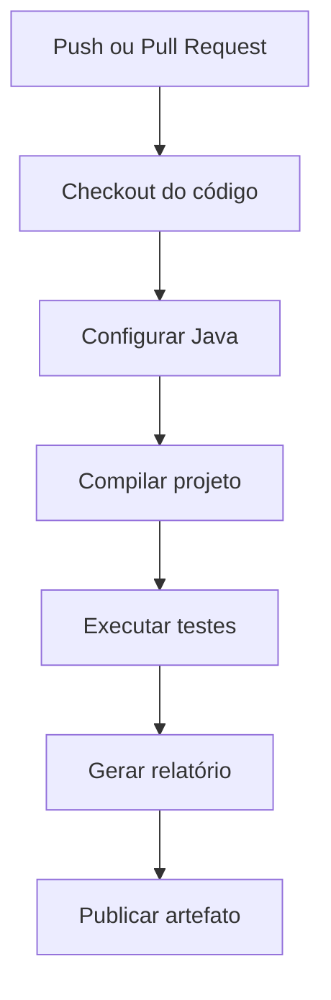

# Projeto: Pipeline de CI com GitHub Actions em Java

Este projeto demonstra como criar uma **pipeline de Integração Contínua (CI)** utilizando **GitHub Actions** para uma aplicação desenvolvida em **Java 21** utilizando **Maven**. A pipeline executará automaticamente as seguintes etapas:

* Fazer o checkout do código;
* Configurar o ambiente Java;
* Restaurar as dependências do Maven;
* Compilar a aplicação;
* Executar os testes automatizados;
* Gerar um relatório simples;
* Publicar o relatório como artefato.

---

# Objetivo do projeto

O projeto implementa uma pequena calculadora em Java com operações matemáticas básicas. Sempre que houver um **push** ou um **Pull Request** para a branch `main`, o GitHub Actions executará automaticamente a pipeline para validar a aplicação.

---

# Estrutura do projeto

```text
java-ci-pipeline/
│
├── src/
│   ├── main/
│   │   └── java/
│   │       └── com/
│   │           └── exemplo/
│   │               ├── Calculator.java
│   │               └── ReportGenerator.java
│   │
│   └── test/
│       └── java/
│           └── com/
│               └── exemplo/
│                   └── CalculatorTest.java
│
├── reports/
│
├── pom.xml
├── README.md
│
└── .github/
    └── workflows/
        └── ci.yml
```

---

# Descrição da estrutura

| Pasta/Arquivo              | Descrição                                                       |
| -------------------------- | --------------------------------------------------------------- |
| `src/main/java`            | Contém o código-fonte da aplicação.                             |
| `src/test/java`            | Contém os testes automatizados utilizando JUnit 5.              |
| `reports/`                 | Diretório onde será gerado o relatório da pipeline.             |
| `pom.xml`                  | Arquivo de configuração do Maven e das dependências do projeto. |
| `.github/workflows/ci.yml` | Workflow responsável pela pipeline no GitHub Actions.           |

---

# Criando o projeto Maven

Crie um novo projeto Maven utilizando o arquétipo padrão:

```bash
mvn archetype:generate \
-DgroupId=com.exemplo \
-DartifactId=java-ci-pipeline \
-DarchetypeArtifactId=maven-archetype-quickstart \
-DinteractiveMode=false
```

---

# Código da aplicação

Arquivo:

```text
src/main/java/com/exemplo/Calculator.java
```

```java
package com.exemplo;

public class Calculator {

    public int sum(int a, int b) {
        return a + b;
    }

    public int subtract(int a, int b) {
        return a - b;
    }

    public int multiply(int a, int b) {
        return a * b;
    }

    public double divide(int a, int b) {

        if (b == 0) {
            throw new IllegalArgumentException("Divisão por zero.");
        }

        return (double) a / b;
    }
}
```

---

# Testes automatizados

Arquivo:

```text
src/test/java/com/exemplo/CalculatorTest.java
```

```java
package com.exemplo;

import org.junit.jupiter.api.Test;

import static org.junit.jupiter.api.Assertions.*;

class CalculatorTest {

    private final Calculator calculator = new Calculator();

    @Test
    void deveSomar() {
        assertEquals(15, calculator.sum(10, 5));
    }

    @Test
    void deveSubtrair() {
        assertEquals(5, calculator.subtract(10, 5));
    }

    @Test
    void deveMultiplicar() {
        assertEquals(50, calculator.multiply(10, 5));
    }

    @Test
    void deveDividir() {
        assertEquals(5, calculator.divide(10, 2));
    }

    @Test
    void deveGerarErroAoDividirPorZero() {

        IllegalArgumentException exception =
                assertThrows(IllegalArgumentException.class,
                        () -> calculator.divide(10, 0));

        assertEquals("Divisão por zero.", exception.getMessage());
    }
}
```

---

# Gerador de relatório

Arquivo:

```text
src/main/java/com/exemplo/ReportGenerator.java
```

```java
package com.exemplo;

import java.io.IOException;
import java.nio.file.Files;
import java.nio.file.Path;
import java.time.LocalDateTime;

public class ReportGenerator {

    public static void main(String[] args) throws IOException {

        Files.createDirectories(Path.of("reports"));

        String report = """
                RELATÓRIO DA PIPELINE
                =====================

                Data: %s

                Status: Testes executados com sucesso.
                """.formatted(LocalDateTime.now());

        Files.writeString(Path.of("reports/report.txt"), report);

        System.out.println("Relatório gerado com sucesso.");
    }
}
```

---

# Arquivo pom.xml

```xml
<project xmlns="http://maven.apache.org/POM/4.0.0"
         xmlns:xsi="http://www.w3.org/2001/XMLSchema-instance"
         xsi:schemaLocation="http://maven.apache.org/POM/4.0.0
         https://maven.apache.org/xsd/maven-4.0.0.xsd">

    <modelVersion>4.0.0</modelVersion>

    <groupId>com.exemplo</groupId>
    <artifactId>java-ci-pipeline</artifactId>
    <version>1.0.0</version>

    <properties>
        <maven.compiler.source>21</maven.compiler.source>
        <maven.compiler.target>21</maven.compiler.target>
        <project.build.sourceEncoding>UTF-8</project.build.sourceEncoding>
        <junit.version>5.10.2</junit.version>
    </properties>

    <dependencies>

        <dependency>
            <groupId>org.junit.jupiter</groupId>
            <artifactId>junit-jupiter</artifactId>
            <version>${junit.version}</version>
            <scope>test</scope>
        </dependency>

    </dependencies>

    <build>

        <plugins>

            <plugin>
                <groupId>org.apache.maven.plugins</groupId>
                <artifactId>maven-surefire-plugin</artifactId>
                <version>3.2.5</version>
            </plugin>

            <plugin>
                <groupId>org.codehaus.mojo</groupId>
                <artifactId>exec-maven-plugin</artifactId>
                <version>3.1.0</version>
            </plugin>

        </plugins>

    </build>

</project>
```

---

# Pipeline do GitHub Actions

Arquivo:

```text
.github/workflows/ci.yml
```

```yaml
name: Java CI Pipeline

on:
  push:
    branches:
      - main

  pull_request:
    branches:
      - main

jobs:

  build:

    runs-on: ubuntu-latest

    steps:

      - name: Checkout do código
        uses: actions/checkout@v4

      - name: Configurar Java
        uses: actions/setup-java@v4
        with:
          distribution: temurin
          java-version: '21'
          cache: maven

      - name: Compilar projeto
        run: mvn clean compile

      - name: Executar testes
        run: mvn test

      - name: Gerar relatório
        run: |
          mvn exec:java \
          -Dexec.mainClass="com.exemplo.ReportGenerator"

      - name: Publicar relatório
        uses: actions/upload-artifact@v4
        with:
          name: relatorio-java
          path: reports/
```

---

# Fluxo da pipeline



---

# Descrição das etapas da pipeline

| Etapa                  | Descrição                                                                                                         |
| ---------------------- | ----------------------------------------------------------------------------------------------------------------- |
| **Checkout do código** | Faz o download do código-fonte do repositório para o ambiente de execução.                                        |
| **Configurar Java**    | Instala o JDK 21 (Temurin) e habilita o cache das dependências do Maven.                                          |
| **Compilar projeto**   | Executa `mvn clean compile`, compilando todo o código-fonte da aplicação.                                         |
| **Executar testes**    | Executa `mvn test`, rodando todos os testes automatizados com JUnit 5.                                            |
| **Gerar relatório**    | Executa a classe `ReportGenerator`, que cria o arquivo `reports/report.txt`.                                      |
| **Publicar artefato**  | Publica o diretório `reports/` como artefato da execução, permitindo seu download pela aba **Actions** do GitHub. |

---

# Resultado esperado

Após realizar um `git push` para a branch `main`, o GitHub Actions executará automaticamente a pipeline:

1. Provisiona um ambiente Ubuntu.
2. Instala o JDK 21 (Temurin).
3. Baixa as dependências definidas no Maven.
4. Compila o projeto.
5. Executa todos os testes automatizados com JUnit 5.
6. Gera um relatório da execução.
7. Publica o relatório como artefato da pipeline.

Esse exemplo segue a estrutura padrão de um projeto Maven e utiliza as ferramentas mais comuns do ecossistema Java. A pipeline pode ser expandida para incluir análise estática com **Checkstyle**, **PMD** e **SpotBugs**, geração de cobertura de testes com **JaCoCo**, análise de qualidade com **SonarQube** e implantação contínua (CD) para servidores de aplicação, contêineres Docker ou plataformas em nuvem.
