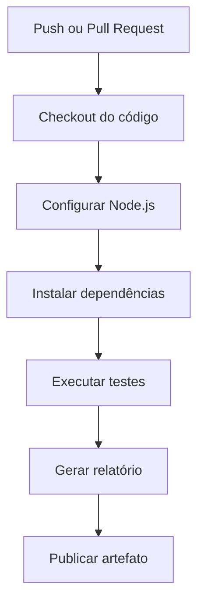

# Projeto: Pipeline de CI com GitHub Actions em JavaScript

Este projeto demonstra como criar uma **pipeline de Integração Contínua (CI)** utilizando **GitHub Actions** para um projeto desenvolvido em **JavaScript (Node.js)**. A pipeline executará automaticamente as seguintes etapas:

* Fazer o checkout do código;
* Configurar o ambiente Node.js;
* Instalar as dependências;
* Executar os testes automatizados;
* Gerar um relatório simples;
* Publicar o relatório como artefato.

---

# Objetivo do projeto

O projeto implementa uma pequena calculadora em JavaScript com operações matemáticas básicas. Sempre que houver um **push** ou um **Pull Request** para a branch `main`, o GitHub Actions executará a pipeline para validar a aplicação.

---

# Estrutura do projeto

```text
javascript-ci-pipeline/
│
├── src/
│   └── calculator.js
│
├── tests/
│   └── calculator.test.js
│
├── reports/
│
├── generate-report.js
├── package.json
├── package-lock.json
├── README.md
│
└── .github/
    └── workflows/
        └── ci.yml
```

---

# Descrição da estrutura

| Pasta/Arquivo              | Descrição                                                                           |
| -------------------------- | ----------------------------------------------------------------------------------- |
| `src/`                     | Contém o código-fonte da aplicação.                                                 |
| `tests/`                   | Contém os testes automatizados utilizando Jest.                                     |
| `reports/`                 | Diretório onde será gerado o relatório da pipeline.                                 |
| `generate-report.js`       | Script responsável por gerar um relatório da execução.                              |
| `package.json`             | Arquivo de configuração do projeto Node.js e suas dependências.                     |
| `package-lock.json`        | Arquivo gerado automaticamente pelo npm com o controle das dependências instaladas. |
| `.github/workflows/ci.yml` | Define a pipeline do GitHub Actions.                                                |

---

# Inicializando o projeto

Crie um novo projeto Node.js:

```bash
npm init -y
```

Instale o framework de testes:

```bash
npm install --save-dev jest
```

---

# Código da aplicação

Arquivo:

```text
src/calculator.js
```

```javascript
function soma(a, b) {
    return a + b;
}

function subtracao(a, b) {
    return a - b;
}

function multiplicacao(a, b) {
    return a * b;
}

function divisao(a, b) {

    if (b === 0) {
        throw new Error("Divisão por zero.");
    }

    return a / b;
}

module.exports = {
    soma,
    subtracao,
    multiplicacao,
    divisao
};
```

---

# Testes automatizados

Arquivo:

```text
tests/calculator.test.js
```

```javascript
const calculator = require("../src/calculator");

test("Soma", () => {
    expect(calculator.soma(10, 5)).toBe(15);
});

test("Subtração", () => {
    expect(calculator.subtracao(10, 5)).toBe(5);
});

test("Multiplicação", () => {
    expect(calculator.multiplicacao(10, 5)).toBe(50);
});

test("Divisão", () => {
    expect(calculator.divisao(10, 2)).toBe(5);
});

test("Divisão por zero", () => {
    expect(() => {
        calculator.divisao(10, 0);
    }).toThrow("Divisão por zero.");
});
```

---

# Gerador de relatório

Arquivo:

```text
generate-report.js
```

```javascript
const fs = require("fs");

if (!fs.existsSync("reports")) {
    fs.mkdirSync("reports");
}

const report = `
RELATÓRIO DA PIPELINE
=====================

Data: ${new Date().toISOString()}

Status: Testes executados com sucesso.
`;

fs.writeFileSync("reports/report.txt", report);

console.log("Relatório gerado.");
```

---

# Arquivo package.json

```json
{
  "name": "javascript-ci-pipeline",
  "version": "1.0.0",
  "description": "Projeto de exemplo utilizando GitHub Actions.",
  "scripts": {
    "test": "jest"
  },
  "devDependencies": {
    "jest": "^30.0.0"
  }
}
```

---

# Pipeline do GitHub Actions

Arquivo:

```text
.github/workflows/ci.yml
```

```yaml
name: JavaScript CI Pipeline

on:
  push:
    branches:
      - main

  pull_request:
    branches:
      - main

jobs:

  build:

    runs-on: ubuntu-latest

    steps:

      - name: Checkout do código
        uses: actions/checkout@v4

      - name: Configurar Node.js
        uses: actions/setup-node@v4
        with:
          node-version: 22

      - name: Instalar dependências
        run: |
          npm ci

      - name: Executar testes
        run: |
          npm test

      - name: Gerar relatório
        run: |
          node generate-report.js

      - name: Publicar relatório
        uses: actions/upload-artifact@v4
        with:
          name: relatorio-javascript
          path: reports/
```

---

# Fluxo da pipeline



---

# Descrição das etapas da pipeline

| Etapa                     | Descrição                                                                                          |
| ------------------------- | -------------------------------------------------------------------------------------------------- |
| **Checkout do código**    | Faz o download do código do repositório para o ambiente de execução.                               |
| **Configurar Node.js**    | Instala a versão do Node.js especificada (`22`).                                                   |
| **Instalar dependências** | Executa `npm ci`, instalando as dependências exatamente como definidas no `package-lock.json`.     |
| **Executar testes**       | Executa os testes automatizados utilizando o framework Jest (`npm test`).                          |
| **Gerar relatório**       | Executa o script `generate-report.js`, que cria um relatório em `reports/report.txt`.              |
| **Publicar artefato**     | Envia o diretório `reports/` como artefato da execução para download na aba **Actions** do GitHub. |

---

# Resultado esperado

Após realizar um `git push` para a branch `main`, o GitHub Actions executará automaticamente a pipeline:

1. Provisiona um ambiente Ubuntu.
2. Instala o Node.js 22.
3. Instala todas as dependências do projeto.
4. Executa os testes automatizados com o Jest.
5. Gera um relatório da execução.
6. Publica o relatório como artefato.

Esse exemplo utiliza as ferramentas mais comuns do ecossistema JavaScript (Node.js, npm e Jest) e pode ser expandido para incluir linting com **ESLint**, formatação com **Prettier**, análise de cobertura de testes (`jest --coverage`), análise de segurança (`npm audit`) e implantação contínua (CD).
