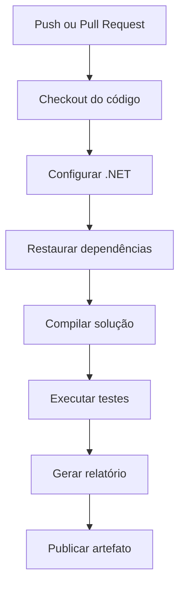

# Projeto: Pipeline de CI com GitHub Actions em .NET

Este projeto demonstra como criar uma **pipeline de Integração Contínua (CI)** utilizando **GitHub Actions** para uma aplicação desenvolvida com **.NET 8**. A pipeline executará automaticamente as seguintes etapas:

* Fazer o checkout do código;
* Configurar o ambiente .NET;
* Restaurar as dependências do projeto;
* Compilar a aplicação;
* Executar os testes automatizados;
* Gerar um relatório simples;
* Publicar o relatório como artefato.

---

# Objetivo do projeto

O projeto implementa uma biblioteca de classes contendo uma calculadora com operações matemáticas básicas. Sempre que houver um **push** ou um **Pull Request** para a branch `main`, o GitHub Actions executará a pipeline para validar a aplicação.

---

# Estrutura do projeto

```text
dotnet-ci-pipeline/
│
├── Calculator/
│   ├── Calculator.cs
│   └── Calculator.csproj
│
├── Calculator.Tests/
│   ├── CalculatorTests.cs
│   └── Calculator.Tests.csproj
│
├── ReportGenerator/
│   ├── Program.cs
│   └── ReportGenerator.csproj
│
├── reports/
│
├── dotnet-ci-pipeline.sln
├── README.md
│
└── .github/
    └── workflows/
        └── ci.yml
```

---

# Descrição da estrutura

| Pasta/Arquivo              | Descrição                                                         |
| -------------------------- | ----------------------------------------------------------------- |
| `Calculator/`              | Biblioteca contendo a implementação da calculadora.               |
| `Calculator.Tests/`        | Projeto de testes utilizando xUnit.                               |
| `ReportGenerator/`         | Aplicação Console responsável por gerar um relatório da pipeline. |
| `reports/`                 | Diretório onde será armazenado o relatório gerado.                |
| `dotnet-ci-pipeline.sln`   | Solution que agrupa todos os projetos.                            |
| `.github/workflows/ci.yml` | Workflow do GitHub Actions.                                       |

---

# Criando a Solution

Crie a solução:

```bash
dotnet new sln -n dotnet-ci-pipeline
```

Crie os projetos:

```bash
dotnet new classlib -n Calculator
dotnet new xunit -n Calculator.Tests
dotnet new console -n ReportGenerator
```

Adicione os projetos à solução:

```bash
dotnet sln add Calculator/Calculator.csproj
dotnet sln add Calculator.Tests/Calculator.Tests.csproj
dotnet sln add ReportGenerator/ReportGenerator.csproj
```

Adicione a referência da biblioteca ao projeto de testes:

```bash
dotnet add Calculator.Tests reference Calculator/Calculator.csproj
```

---

# Código da aplicação

Arquivo:

```text
Calculator/Calculator.cs
```

```csharp
using System;

namespace Calculator;

public class Calculator
{
    public int Sum(int a, int b)
    {
        return a + b;
    }

    public int Subtract(int a, int b)
    {
        return a - b;
    }

    public int Multiply(int a, int b)
    {
        return a * b;
    }

    public double Divide(int a, int b)
    {
        if (b == 0)
            throw new DivideByZeroException("Divisão por zero.");

        return (double)a / b;
    }
}
```

---

# Testes automatizados

Arquivo:

```text
Calculator.Tests/CalculatorTests.cs
```

```csharp
using Xunit;
using Calculator;

namespace Calculator.Tests;

public class CalculatorTests
{
    private readonly Calculator.Calculator calculator = new();

    [Fact]
    public void DeveSomar()
    {
        Assert.Equal(15, calculator.Sum(10, 5));
    }

    [Fact]
    public void DeveSubtrair()
    {
        Assert.Equal(5, calculator.Subtract(10, 5));
    }

    [Fact]
    public void DeveMultiplicar()
    {
        Assert.Equal(50, calculator.Multiply(10, 5));
    }

    [Fact]
    public void DeveDividir()
    {
        Assert.Equal(5, calculator.Divide(10, 2));
    }

    [Fact]
    public void DeveGerarErroAoDividirPorZero()
    {
        Assert.Throws<DivideByZeroException>(() =>
        {
            calculator.Divide(10, 0);
        });
    }
}
```

---

# Gerador de relatório

Arquivo:

```text
ReportGenerator/Program.cs
```

```csharp
using System;
using System.IO;

Directory.CreateDirectory("reports");

var report = $"""
RELATÓRIO DA PIPELINE
=====================

Data: {DateTime.Now:yyyy-MM-dd HH:mm:ss}

Status: Testes executados com sucesso.
""";

File.WriteAllText("reports/report.txt", report);

Console.WriteLine("Relatório gerado com sucesso.");
```

---

# Pipeline do GitHub Actions

Arquivo:

```text
.github/workflows/ci.yml
```

```yaml
name: .NET CI Pipeline

on:
  push:
    branches:
      - main

  pull_request:
    branches:
      - main

jobs:

  build:

    runs-on: ubuntu-latest

    steps:

      - name: Checkout do código
        uses: actions/checkout@v4

      - name: Configurar .NET
        uses: actions/setup-dotnet@v4
        with:
          dotnet-version: '8.0.x'

      - name: Restaurar dependências
        run: |
          dotnet restore

      - name: Compilar solução
        run: |
          dotnet build --configuration Release --no-restore

      - name: Executar testes
        run: |
          dotnet test --configuration Release --no-build

      - name: Gerar relatório
        run: |
          dotnet run --project ReportGenerator

      - name: Publicar relatório
        uses: actions/upload-artifact@v4
        with:
          name: relatorio-dotnet
          path: reports/
```

---

# Fluxo da pipeline



---

# Descrição das etapas da pipeline

| Etapa                      | Descrição                                                                                                       |
| -------------------------- | --------------------------------------------------------------------------------------------------------------- |
| **Checkout do código**     | Faz o download do código-fonte do repositório para o ambiente de execução.                                      |
| **Configurar .NET**        | Instala o SDK do .NET 8 na máquina virtual do GitHub Actions.                                                   |
| **Restaurar dependências** | Executa `dotnet restore` para baixar todos os pacotes NuGet necessários ao projeto.                             |
| **Compilar solução**       | Executa `dotnet build`, verificando se todos os projetos da solução compilam corretamente.                      |
| **Executar testes**        | Executa os testes automatizados utilizando o framework xUnit com `dotnet test`.                                 |
| **Gerar relatório**        | Executa o projeto `ReportGenerator`, que cria o arquivo `reports/report.txt`.                                   |
| **Publicar artefato**      | Publica o diretório `reports/` como artefato da execução, permitindo seu download na aba **Actions** do GitHub. |

---

# Resultado esperado

Ao realizar um `git push` para a branch `main`, o GitHub Actions executará automaticamente a pipeline:

1. Provisiona um ambiente Ubuntu.
2. Instala o SDK do .NET 8.
3. Restaura os pacotes NuGet da solução.
4. Compila todos os projetos.
5. Executa os testes automatizados.
6. Gera um relatório da execução.
7. Publica o relatório como artefato.

Esse exemplo segue as práticas recomendadas para projetos .NET, utilizando uma **Solution (.sln)** para organizar os projetos, uma biblioteca de classes para a lógica da aplicação, um projeto de testes com **xUnit** e uma aplicação Console para geração de relatórios. A pipeline pode ser expandida para incluir análise estática com **Roslyn Analyzers**, cobertura de testes com **Coverlet**, geração de relatórios de cobertura com **ReportGenerator** e implantação contínua (CD) para ambientes como Azure App Service, IIS, Docker ou Kubernetes.
