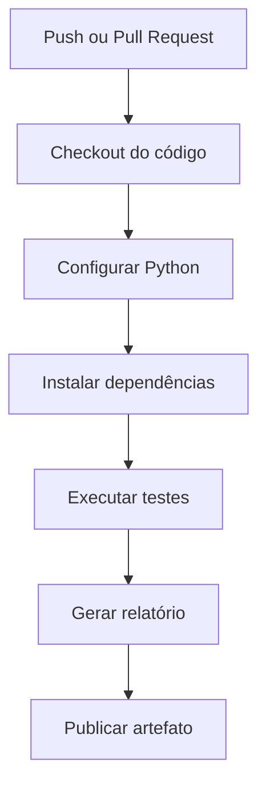

# Projeto: Pipeline de CI com GitHub Actions em Python

Este projeto demonstra como criar uma **pipeline de Integração Contínua (CI)** utilizando **GitHub Actions** para um projeto Python. A pipeline será responsável por:

* Fazer o checkout do código;
* Configurar o ambiente Python;
* Instalar as dependências;
* Executar os testes automatizados;
* Gerar um artefato contendo um relatório simples.

---

# Objetivo do projeto

O projeto implementa uma pequena calculadora em Python com operações básicas. Os testes são executados automaticamente sempre que houver um **push** ou **Pull Request** para a branch `main`.

---

# Estrutura do projeto

```text
python-ci-pipeline/
│
├── app/
│   ├── __init__.py
│   └── calculadora.py
│
├── tests/
│   └── test_calculadora.py
│
├── reports/
│
├── requirements.txt
├── gerar_relatorio.py
├── README.md
│
└── .github/
    └── workflows/
        └── ci.yml
```

## Descrição da estrutura

| Pasta/Arquivo              | Descrição                                           |
| -------------------------- | --------------------------------------------------- |
| `app/`                     | Contém o código-fonte da aplicação.                 |
| `tests/`                   | Contém os testes automatizados utilizando o Pytest. |
| `reports/`                 | Diretório onde será gerado o relatório da execução. |
| `requirements.txt`         | Lista das dependências do projeto.                  |
| `gerar_relatorio.py`       | Script responsável por gerar um relatório simples.  |
| `.github/workflows/ci.yml` | Define a pipeline do GitHub Actions.                |

---

# Código da aplicação

Arquivo:

```text
app/calculadora.py
```

```python
class Calculadora:

    def soma(self, a, b):
        return a + b

    def subtracao(self, a, b):
        return a - b

    def multiplicacao(self, a, b):
        return a * b

    def divisao(self, a, b):
        if b == 0:
            raise ValueError("Divisão por zero.")
        return a / b
```

---

# Testes automatizados

Arquivo:

```text
tests/test_calculadora.py
```

```python
from app.calculadora import Calculadora

calc = Calculadora()

def test_soma():
    assert calc.soma(10, 5) == 15

def test_subtracao():
    assert calc.subtracao(10, 5) == 5

def test_multiplicacao():
    assert calc.multiplicacao(10, 5) == 50

def test_divisao():
    assert calc.divisao(10, 2) == 5

def test_divisao_por_zero():
    try:
        calc.divisao(10, 0)
        assert False
    except ValueError:
        assert True
```

---

# Dependências

Arquivo:

```text
requirements.txt
```

```text
pytest
```

---

# Script para geração do relatório

Arquivo:

```text
gerar_relatorio.py
```

```python
from datetime import datetime
from pathlib import Path

Path("reports").mkdir(exist_ok=True)

with open("reports/relatorio.txt", "w", encoding="utf-8") as arquivo:
    arquivo.write("RELATÓRIO DA PIPELINE\n")
    arquivo.write("=====================\n")
    arquivo.write(f"Data: {datetime.now()}\n")
    arquivo.write("Status: Testes executados com sucesso.\n")

print("Relatório gerado.")
```

---

# Pipeline do GitHub Actions

Arquivo:

```text
.github/workflows/ci.yml
```

```yaml
name: Python CI Pipeline

on:
  push:
    branches:
      - main

  pull_request:
    branches:
      - main

jobs:

  build:

    runs-on: ubuntu-latest

    steps:

      - name: Checkout do código
        uses: actions/checkout@v4

      - name: Configurar Python
        uses: actions/setup-python@v5
        with:
          python-version: "3.12"

      - name: Instalar dependências
        run: |
          python -m pip install --upgrade pip
          pip install -r requirements.txt

      - name: Executar testes
        run: |
          pytest

      - name: Gerar relatório
        run: |
          python gerar_relatorio.py

      - name: Publicar relatório
        uses: actions/upload-artifact@v4
        with:
          name: relatorio-pipeline
          path: reports/
```

---

# Fluxo da pipeline



---

# Descrição das etapas da pipeline

| Etapa                     | Descrição                                                                                        |
| ------------------------- | ------------------------------------------------------------------------------------------------ |
| **Checkout do código**    | Faz o download do código-fonte do repositório para o ambiente de execução.                       |
| **Configurar Python**     | Instala a versão do Python especificada (`3.12`).                                                |
| **Instalar dependências** | Atualiza o `pip` e instala os pacotes definidos em `requirements.txt`.                           |
| **Executar testes**       | Executa os testes automatizados com o Pytest. Caso algum teste falhe, a pipeline é interrompida. |
| **Gerar relatório**       | Executa um script Python que cria um relatório simples em formato texto.                         |
| **Publicar artefato**     | Envia o diretório `reports/` como artefato para download na execução da pipeline.                |

---

# Resultado esperado

Ao realizar um `git push` para a branch `main`:

1. O GitHub Actions inicia automaticamente a pipeline.
2. O ambiente Ubuntu é provisionado.
3. O Python 3.12 é instalado.
4. As dependências do projeto são instaladas.
5. Os testes automatizados são executados.
6. Um relatório (`reports/relatorio.txt`) é gerado.
7. O relatório é publicado como artefato e pode ser baixado pela aba **Actions** do GitHub.

Esse projeto apresenta uma estrutura simples, mas segue boas práticas de organização e demonstra os principais conceitos de uma pipeline de CI com GitHub Actions aplicada a um projeto Python.
