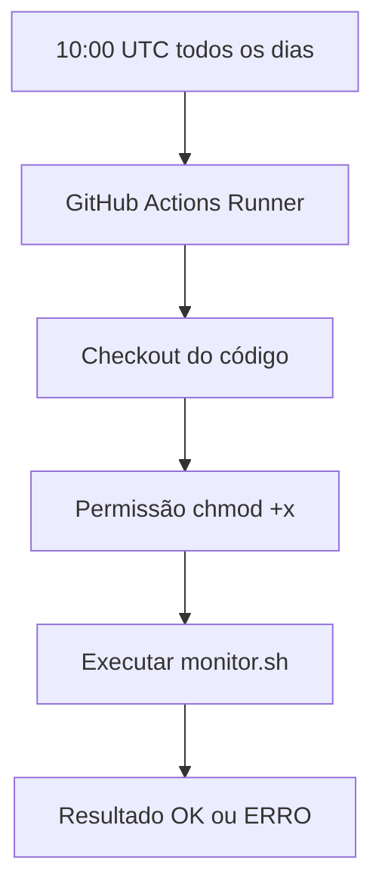

Projeto: Pipeline de CI com GitHub Actions em Shell Script

Para executar um script **Shell (`monitor.sh`) todos os dias às 10:00**, você pode utilizar o gatilho `schedule` do GitHub Actions com uma expressão **cron**.

> O GitHub Actions utiliza o horário **UTC** no `cron`. Caso você queira executar às 10:00 em um fuso horário específico, é necessário converter para UTC.

## Estrutura do projeto

```text
monitor-pipeline/
│
├── scripts/
│   └── monitor.sh
│
└── .github/
    └── workflows/
        └── monitor.yml
```

---

## Script Shell

Arquivo:

```text
scripts/monitor.sh
```

Exemplo:

```bash
#!/bin/bash

echo "================================="
echo "Monitoramento iniciado"
echo "Data: $(date)"
echo "================================="

# Exemplo de verificação
echo "Verificando serviço..."

# Simulação de monitoramento
STATUS="OK"

if [ "$STATUS" = "OK" ]; then
    echo "Sistema saudável"
    exit 0
else
    echo "Problema encontrado"
    exit 1
fi
```

Dê permissão de execução:

```bash
chmod +x scripts/monitor.sh
```

---

# Pipeline GitHub Actions

Arquivo:

```text
.github/workflows/monitor.yml
```

```yaml
name: Monitor Pipeline

on:
  schedule:
    - cron: '0 10 * * *'

  workflow_dispatch:

jobs:

  monitor:

    runs-on: ubuntu-latest

    steps:

      - name: Checkout do código
        uses: actions/checkout@v4

      - name: Dar permissão ao script
        run: chmod +x scripts/monitor.sh

      - name: Executar monitoramento
        run: ./scripts/monitor.sh
```

---

# Explicação do workflow

## Agendamento

```yaml
schedule:
  - cron: '0 10 * * *'
```

Significado:

```
┌──────── minuto (0)
│ ┌────── hora (10)
│ │ ┌──── dia do mês (*)
│ │ │ ┌── mês (*)
│ │ │ │ ┌ dia da semana (*)
│ │ │ │ │
0 10 * * *
```

Executa:

```
Todos os dias às 10:00 UTC
```

---

## Execução manual

```yaml
workflow_dispatch:
```

Permite executar a pipeline manualmente pelo GitHub:

```
Repository
   |
   └── Actions
          |
          └── Monitor Pipeline
                  |
                  └── Run workflow
```

---

# Fluxo da pipeline



---

# Melhorias possíveis para uma pipeline real de monitoramento

Você poderia adicionar:

* Envio de alerta quando falhar:

  * Slack
  * Microsoft Teams
  * E-mail
  * Discord

* Armazenamento de logs:

```yaml
- name: Upload Logs
  uses: actions/upload-artifact@v4
  with:
    name: monitor-log
    path: logs/
```

* Execução em múltiplos ambientes:

```yaml
strategy:
  matrix:
    environment:
      - production
      - staging
```

* Monitoramento de servidores via SSH:

```bash
ssh usuario@servidor "./monitor.sh"
```

Essa pipeline é uma base simples de **monitoramento agendado (Scheduled CI Job)** usando GitHub Actions.
