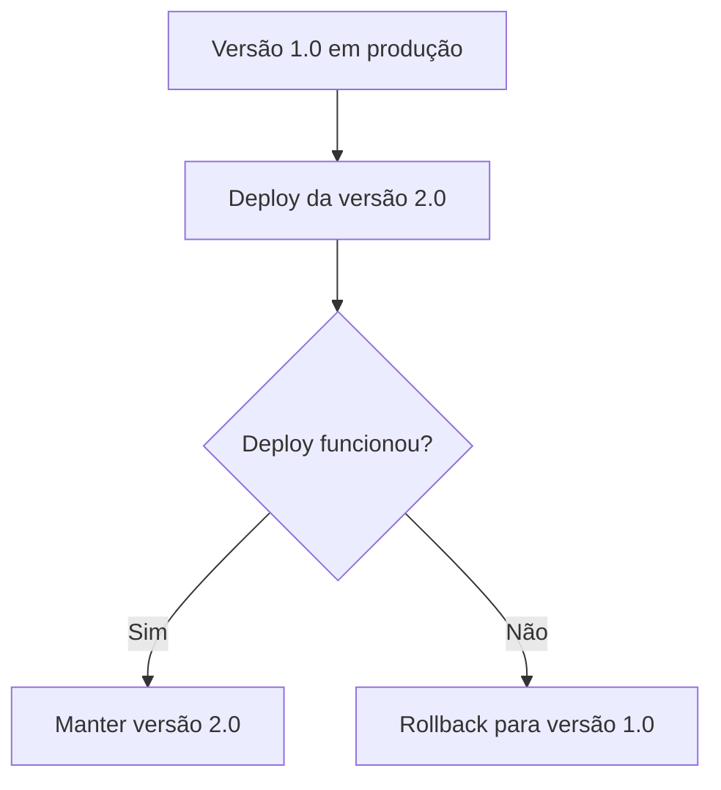
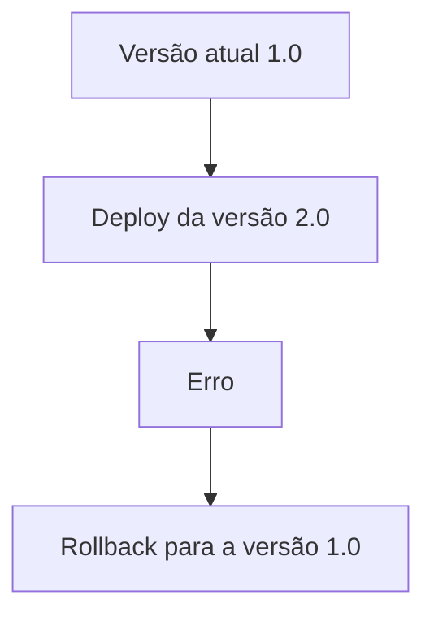
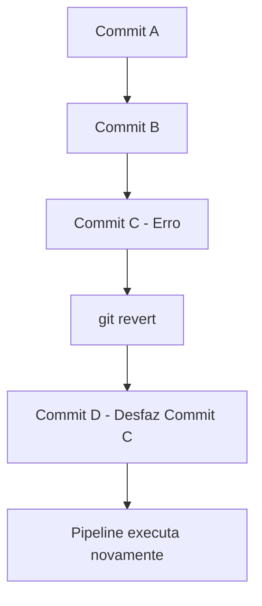
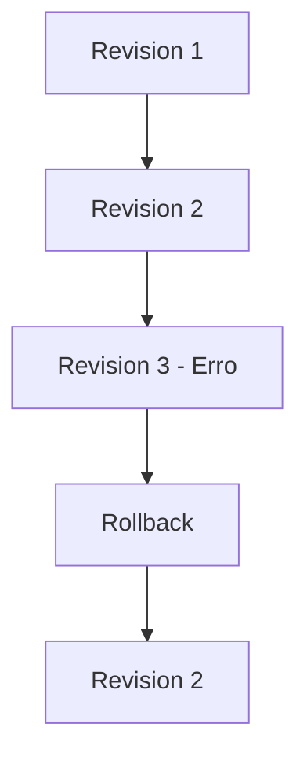
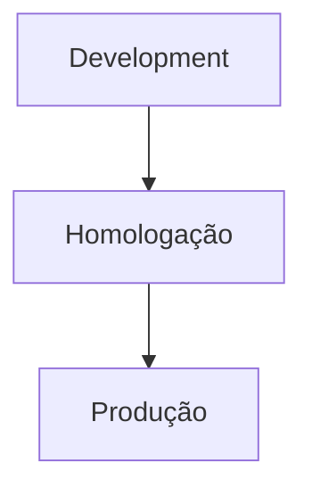
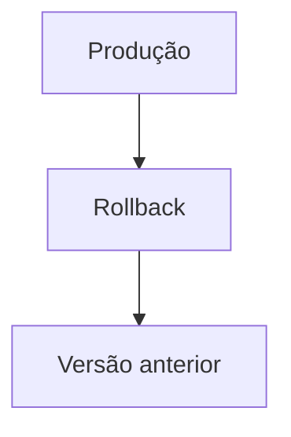
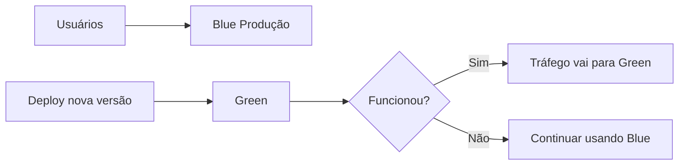
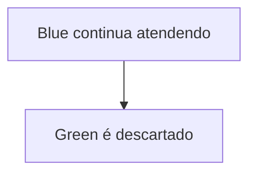
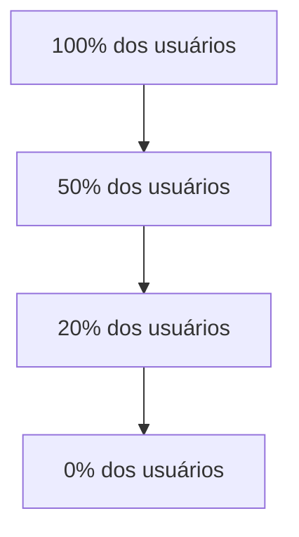
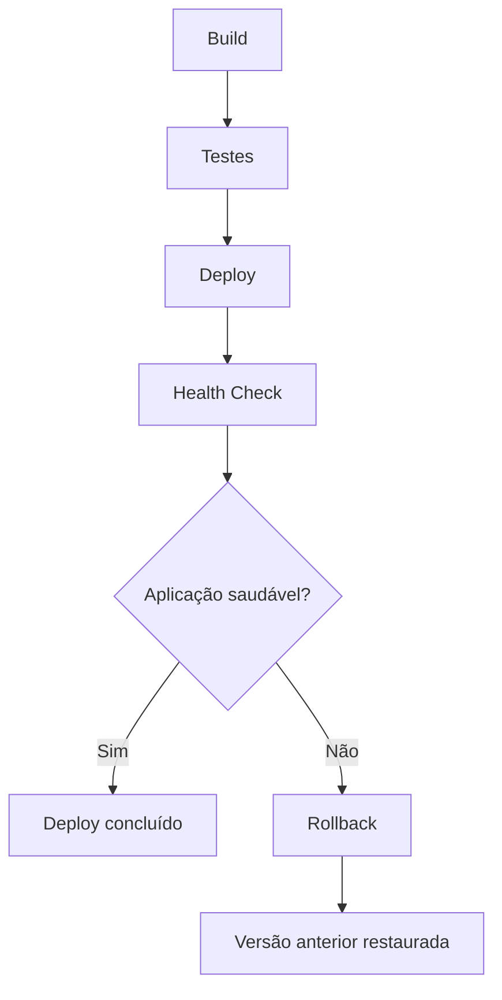

# Rollback

O **GitHub Actions não realiza rollback automaticamente**. Ele apenas executa os passos definidos no workflow. O rollback precisa ser implementado pela própria pipeline ou pela estratégia de implantação utilizada (Docker, Kubernetes, Azure, AWS, etc.).

Abaixo estão as formas mais comuns de realizar rollback.

---

# Estratégia 1 – Fazer rollback para a versão anterior

A abordagem mais comum é manter a versão anterior da aplicação disponível.

Fluxo:



Exemplo:



---

# Estratégia 2 – Utilizando GitHub Releases

Uma prática comum é publicar cada versão como uma **Release**.

```
Release 1.0

Release 1.1

Release 1.2
```

Se a versão **1.2** apresentar problemas, basta fazer o deploy da **Release 1.1**.

---

# Estratégia 3 – Utilizando Tags

Antes de cada deploy:

```
v1.0

v1.1

v1.2
```

Caso seja necessário retornar:

```bash
git checkout v1.1
```

Depois execute novamente a pipeline utilizando essa tag.

---

# Estratégia 4 – Rollback utilizando Git

Caso o código publicado esteja incorreto, é possível desfazer o commit.

Exemplo:

```bash
git revert HEAD
git push
```

Fluxo:



O histórico permanece preservado.

---

# Estratégia 5 – Rollback utilizando Docker

Uma das estratégias mais utilizadas.

Imagine:

```
app:1.0

app:1.1

app:1.2
```

O deploy utiliza:

```
app:1.2
```

Caso haja falha:

```
docker stop app

docker run app:1.1
```

A versão anterior volta rapidamente.

---

# Estratégia 6 – Rollback no Kubernetes

O Kubernetes mantém o histórico das implantações.

Exemplo:

```bash
kubectl rollout undo deployment/api
```

Ou voltar para uma revisão específica:

```bash
kubectl rollout undo deployment/api --to-revision=2
```

Fluxo:



---

# Estratégia 7 – Rollback utilizando ambientes

Uma prática muito utilizada é separar os ambientes.



Se a produção apresentar falha:



---

# Estratégia 8 – Blue/Green Deployment

Mantêm-se dois ambientes idênticos.



Se houver erro:



Quase não há indisponibilidade.

---

# Estratégia 9 – Canary Deployment

A nova versão é liberada para poucos usuários.

```
flowchart TD
    A[5% dos usuários] --> B[20% dos usuários]
    B --> C[50% dos usuários]
    C --> D[100% dos usuários]
```

Caso apareçam erros:



A nova versão é retirada antes de afetar todos os usuários.

---

# Estratégia 10 – Rollback automático na pipeline

Uma pipeline pode detectar falhas após o deploy e executar automaticamente um rollback.

Exemplo:

```yaml
name: Deploy

jobs:

  deploy:

    runs-on: ubuntu-latest

    steps:

      - name: Deploy
        run: ./deploy.sh

      - name: Health Check
        run: ./healthcheck.sh

      - name: Rollback
        if: failure()
        run: ./rollback.sh
```

Nesse fluxo:

* `deploy.sh` publica a nova versão;
* `healthcheck.sh` verifica se a aplicação está saudável;
* se qualquer etapa falhar, `rollback.sh` é executado automaticamente graças à condição `if: failure()`.

---

# Fluxo completo



---

# Resumo

| Estratégia                   | Vantagem                                | Cenário de uso                          |
| ---------------------------- | --------------------------------------- | --------------------------------------- |
| `git revert`                 | Simples e mantém o histórico            | Código incorreto enviado ao repositório |
| Releases/Tags                | Fácil de identificar versões            | Controle de versões da aplicação        |
| Docker                       | Retorno rápido para uma imagem anterior | Aplicações conteinerizadas              |
| Kubernetes Rollout           | Rollback nativo                         | Aplicações em Kubernetes                |
| Blue/Green                   | Baixíssima indisponibilidade            | Sistemas críticos                       |
| Canary                       | Reduz impacto de falhas                 | Grandes aplicações com muitos usuários  |
| Pipeline com `if: failure()` | Automatiza a recuperação                | Deploys com validação automática        |

Em resumo, o **GitHub Actions orquestra o processo**, mas o rollback depende da tecnologia utilizada para o deploy. Em ambientes modernos, é comum combinar GitHub Actions com Docker ou Kubernetes, pois essas plataformas oferecem mecanismos rápidos e confiáveis para retornar à versão anterior caso algo dê errado.
